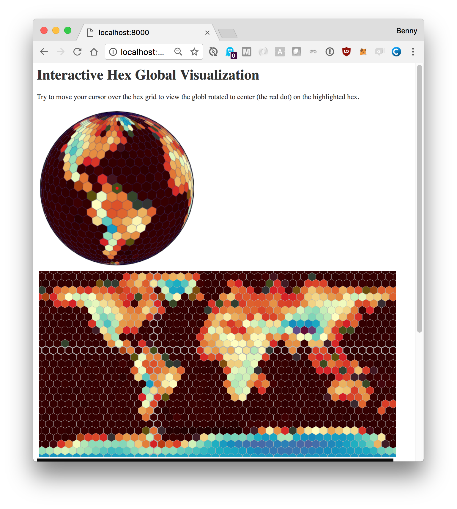

## D3HexMap - Tesselating the World with Hexagon Tiles
This repo is a companion demo for
the article on *Interactive Hex World Map using D3*
<http://bennycheung.github.io/interactive-hex-world-map-using-d3>

We wonder if marrying a hexagonal tile system
with the traditional geographic system (longitude/latitude)
will provide a better reasoning and visual perception.

## How to Run

Go into D3HexMap directory,

* for python 2.x

```
python -m SimpleHttpServer
```

* for python 3.x

```
python3 -m http.server
```

or use any Http server to serve this site.

Navigate from the browser to http://localhost:8000 (default port is 8000)
to see the main page `index.html`.

Then you should see the following,


## Implementation Details

### hexlib.js
The hexagonal representation and mathematic functions are implemented in `hexlib.js`,
which is essentially Amit's Hex Grid implementation, details are here <https://www.redblobgames.com/grids/hexagons/implementation.html>

### hexlib_ui.js
The hex grid interactivity is provided by `hexlib_ui.js`,
which is carefully extracted and cleaned up from the hexagon explanation page at <http://www.redblobgames.com/grids/hexagons.html>,
making the code has minimal dependencies so that the script can be easily reused on other pages.

The `makeGridDiagram(svg, cubes)` will take,

1. Convert a list of hexagonal cube object, and create a list of nodes = {cube: Cube object, key: string, node: d3 selection of <g> containing polygon}
2. Make diagram = d3 selection of root <g> of diagram
3. Make polygons = d3 selection of the hexagons inside the <g> per tile
4. Define update = function(scale, orientation) to call any time orientation changes, including initialization
5. Setup onLayout = callback function that will be called before an update (to assign new cube coordinates);this will be called immediately on update
6. Setup onUpdate = callback function that will be called after an update; this will be called after a delay, and only if there hasn't been another update

The hex grid diagram is later called with `addHexCoordinates()` from `hexglobe.js` function `makeHexOddR()`;
this is how the interactivity of the mouse movement is detected.
If the mouse is over the hex grid,
the selected (row,column) cells are classed with highlighting, and the globe's `updateGlobe()` function is called with the selected cell (lon, lat) for the globe rotation and view.

### hexglobe.js
Finally with the support of previous routines,
the `hexglobe.js` adds a set of convenience functions to build the interactive hex grid and globe for the visualization. They are briefly described here,

* `makeHexOddR(svg, hexsize, width, height)`
  * create a "odd-r" hex grid, with the given hexagon pixels size, and the width, height of the reference terrain image.
* `screenToLonLat(grid_odd_r, screenPoint)`
  * transform the screen coordinate on the image to (lon, lat) point
* `hexToLonLatHex(grid_odd_r, hex)`
  * transform the hex grid (q, r) coordinate to a polygon with the list of (lon, lat) points
* `hexWorldGrid(grid_odd_r)`
  * create topojson line features for the hex world grid
* `makeHexBinMap(grid_odd_r, hexbin_id, hexsize, image_url, width, height)`
  * define d3.hexbin
  * define the color gradient map
  * read the terrain image and hexbin() each pixel value
    * for each hex, find the average of the pixel values
  * for each hex, map the average pixel value to a color, according to it's gradient range.
  * construct the world hex "odd-r" grid with all the colored hex polygons

The globe is constructed from `world-110m.json` topojson file, then the hex grid is projected onto the globe surface. A timer is setup to check if the globe's projection has been updated; consequently, the global will be rotated and redrawn to center at the given (lon, lat) location.
